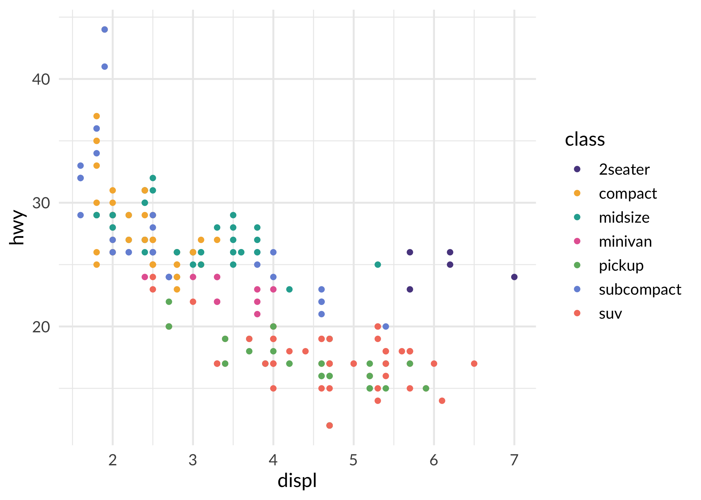
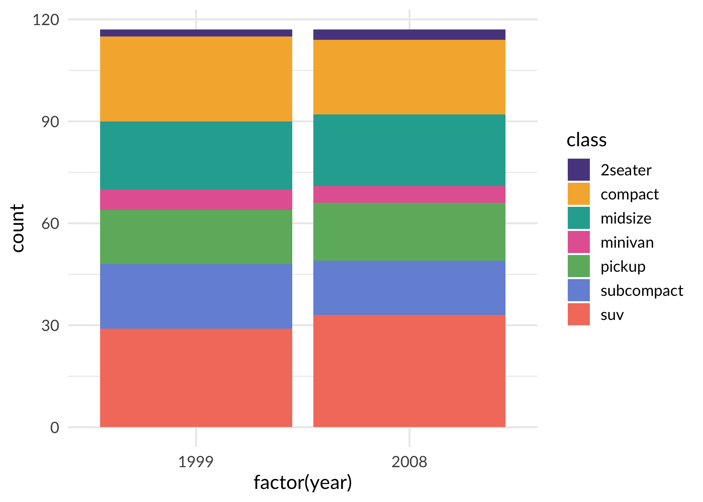
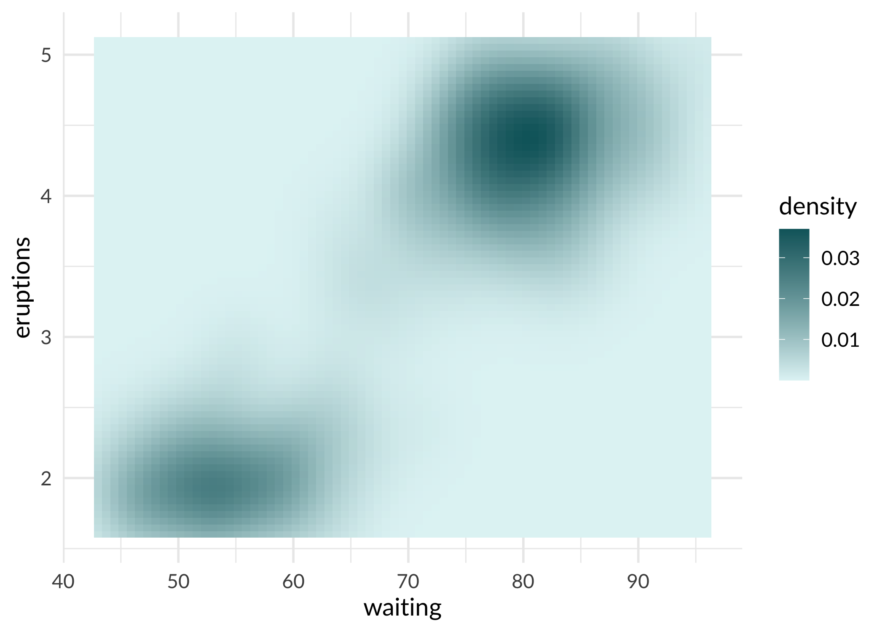
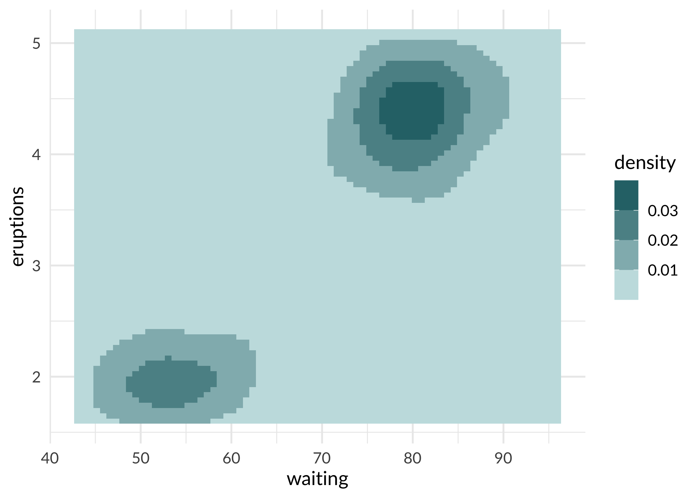

<!-- README.md is generated from README.Rmd. Please edit that file -->

# sagethemes

<!-- badges: start -->

[](https://github.com/Sage-Bionetworks/sagethemes/actions)
<!-- badges: end -->

The sagethemes package provides plot color palettes and themes that use
the Sage Bionetworks branded colors.

## Installation

``` r
remotes::install_github("Sage-Bionetworks/sagethemes")
```

## Colors

Colors were developed by the Sage design team and are available in the
list `sage_colors`.

``` r
library("sagethemes")
head(sage_colors, n = 3)
#> $royal
#>       200       300       400       500       600       700       800 
#> "#D5CFE3" "#B2A5D1" "#907FBA" "#5A478F" "#47337D" "#332069" "#251454" 
#> 
#> $powder
#>       200       300       400       500       600       700       800 
#> "#E1F4F5" "#C5EDF0" "#A6DDE0" "#7EC8CC" "#5BB0B5" "#2F8E94" "#0C656B" 
#> 
#> $coral
#>       200       300       400       500       600       700       800 
#> "#F7E2DF" "#FFC5BD" "#FCA79A" "#F47E6C" "#DA614F" "#BD422F" "#8F1D0B"
```

## Usage

sagethemes provides continuous, discrete, and binned scales. It also
provides a default theme, `theme_sage()`, which is currently just
`theme_gray()` but with Lato as the font family. Lato must be installed
for this theme to work. See the Fonts section below, and `?import_lato`
for more information.

``` r
library("ggplot2")
library("sagethemes")

# discrete
ggplot(mpg, aes(displ, hwy, colour = class)) +
  geom_point() +
  scale_color_sage_d() +
  theme_sage()
```



``` r

ggplot(mpg, aes(x = factor(year), fill = class)) +
  geom_bar() +
  scale_fill_sage_d() +
  theme_sage()
```



``` r
# continuous
ggplot(faithfuld, aes(waiting, eruptions, fill = density)) +
  geom_tile() +
  scale_fill_sage_c(option = "powder") +
  theme_sage()
```



``` r
# binned
ggplot(faithfuld, aes(waiting, eruptions, fill = density)) +
  geom_tile() +
  scale_fill_sage_b(option = "powder") +
  theme_sage()
```



## Fonts

Sage Bionetworks uses [Lato](http://www.latofonts.com/lato-free-fonts/).
If you’ve installed Lato on your system, you should be able to use it in
plots.

However, to output to PDF, PostScript, or bitmap files on Windows, you
need to register the font. sagethemes includes a copy of Lato, and you
can load it with `import_lato()`. If saving to PDF you’ll also need to
embed Lato in the PDF file.

``` r
import_lato()

p <- ggplot(mpg, aes(displ, hwy, colour = class)) +
  geom_point() +
  scale_color_sage_d() +
  theme_sage()

# Save PDF plot and embed Lato font
ggsave("plot.pdf", plot = p)
embed_fonts("plot.pdf", outfile = "plot_embed.pdf")
```

-----

## Code of Conduct

Please note that the dccvalidator project is released with a
[Contributor Code of Conduct](.github/CODE_OF_CONDUCT.md). By
contributing to this project, you agree to abide by its terms.
